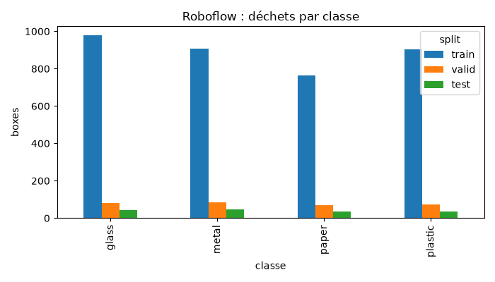
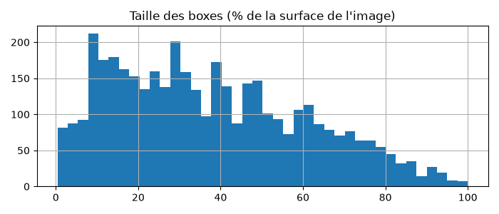
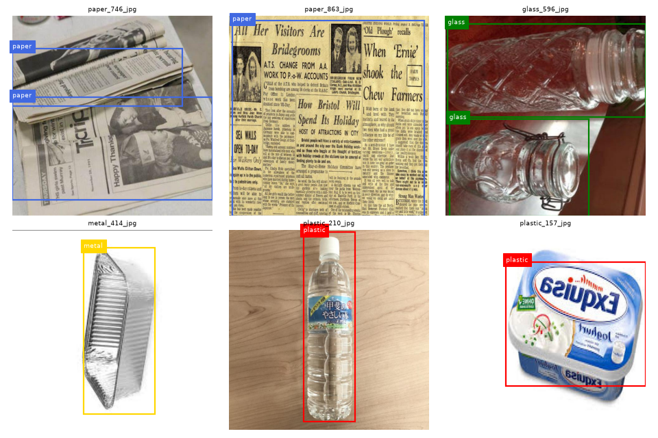

# EDA · Roboflow garbage classification by yolo

## Chiffres
- Classes (ordre de data.yaml) : 0 = glass, 1 = metal, 2 = paper, 3 = plastic
- Images : train 2517, valid 240, test 120 ; photos d'origine : 1199
- Copies augmentées par photo dans train : 3.0
- Déchets par classe : glass: 1100, metal: 1040, plastic: 1012, paper: 871
- Déchets par image : 1.4 en moyenne, max 20
- Petites boxes (< 32 px) : 0.1 %
- Photos d'origine présentes dans plusieurs splits (fuites) : 0

## Ce qu'on retient pour la suite
1. Fuites : Aucune fuite détectée entre les splits (0)
2. Taille des boxes : Très peu de petites boxes (0.1 %), la taille imgsz 640 est largement suffisante
3. Classes : cardboard et trash n'existent pas ici, c'est le CNN qui les apportera