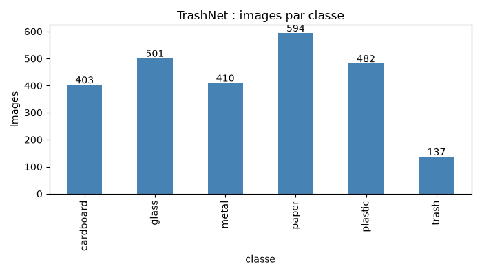
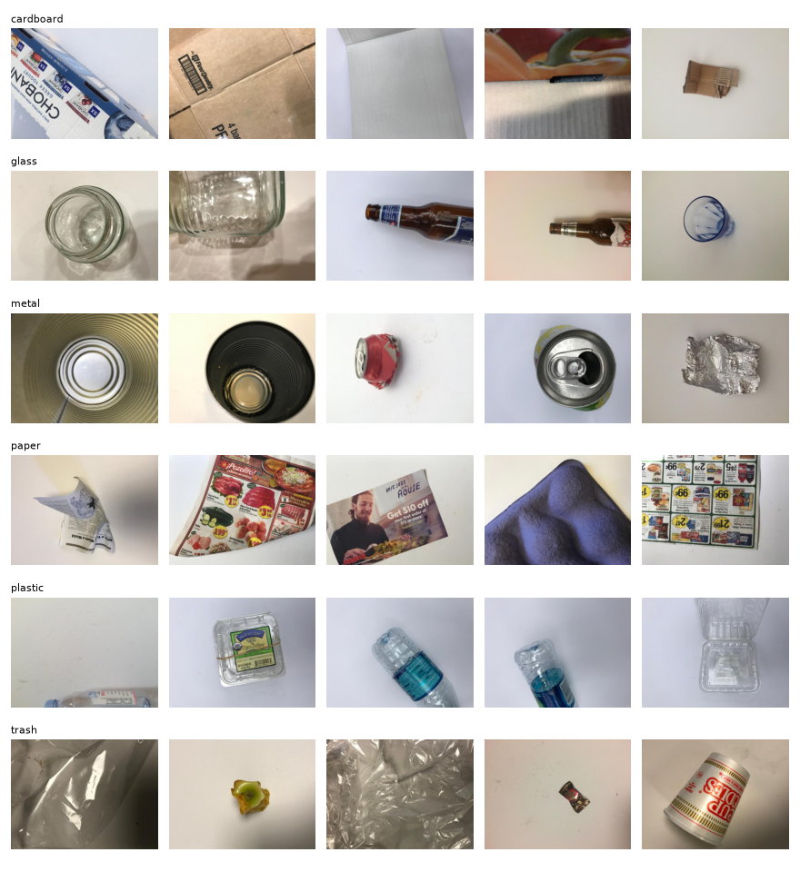
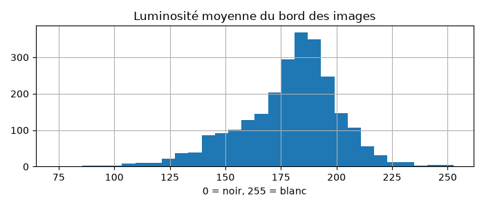

# EDA · TrashNet

## Chiffres
- Total : 2527 images, 6 classes
- Par classe : cardboard 403, glass 501, metal 410, paper 594, plastic 482, trash 137
- Classe la plus rare : trash (5.4 %), rapport plus grande / plus petite : 4.3
- Taille des images : 512 x 384
- Bord clair (fond blanc) : 56 % des images
- Doublons exacts : 6 images concernées par des doublons exacts

## Ce qu'on retient pour la suite
1. Déséquilibre : Trash n’a que 137 images (5,4 %), soit 4,3 fois moins que paper
2. Fond : 56 % des images ont un fond blanc
3. Découpage : stratifié par classe, en 70/15/15, avec une graine fixe pour qu’il soit reproductible.
4. Doublons : on retire les 6 doublons exacts avant le découpage, pour qu’une même image ne se retrouve pas à la fois dans train et dans test.